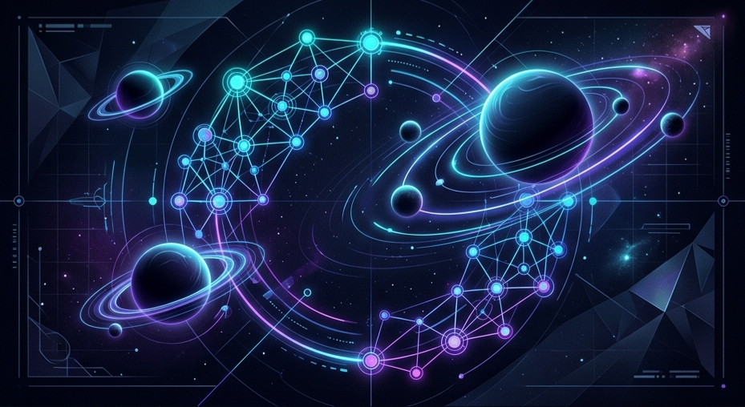

  

  

---

### 🌌 About Me

Hi! I am **alemant-git**. I'm specializing in AI agent development, complex system architecture, and process automation (including private repositories).

My primary focus currently is the **Antigravity** project, which harnesses the cumulative power of multiple specialized agents to tackle complex technical and creative challenges.

---

### 🤖 AI Tool Stack

| Category | Tools |
| :--- | :--- |
| **LLMs** | Google Gemini (Pro/Flash), Claude 3.5 (Opus/Sonnet), GPT-5, Grok, etc. |
| **Frameworks** | MCP (Model Context Protocol), LangChain, LangGraph |
| **Automation** | Antigravity Agents, Python Automation |
| **AI Productivity** | NotebookLM, Visual Studio Code, Perplexity, etc. |

---

### 💻 Tech Stack

  
  
  
  
  
  
  
  
  

---

### 🔗 Get in Touch

  
  

---

  <i>"Beyond the limits of gravity."</i>

